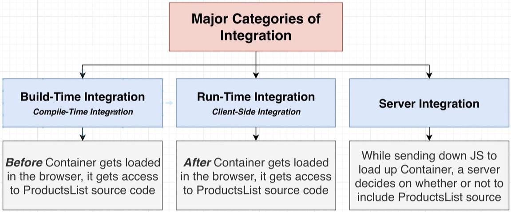

# Basics

**Monolithic Single Page Application** - All of the code of our application is in one single codebase.

**Microfrontend Application** (MFEA) - Divided monolithic app into multiple, _smaller apps with their own codebase_.
- The different codebases communicate through **API requests** that manage the data to avoid direct communication between those two distinct projects.
- Each smaller app is responsible for a **distinct feature** of the product.

**Benefits:**
- Multiple engineering teams can work on the apps in isolation.
- Each of these applications can be thought of as separate independent apps which make it easier to understand, develop and maintain as they are not dependent on each other in any way.

We should try to **limit the direct communication between the MFEAs** as much as possible. This could be achieved by a **common APIs**.

Common API
  

Container


Integration

- Build time:
  
- Real-time
  


# Webpack
[microfrontends\e-commerce](../microfrontends/e-commerce)

```js
module.exports = {
  mode: 'development',
  devServer: {
    port: 8081
  },
  plugins: [
    new HtmlWebpackPlugin({
      template: './public/index.html'
    })
  ]
}
```

# Module federation