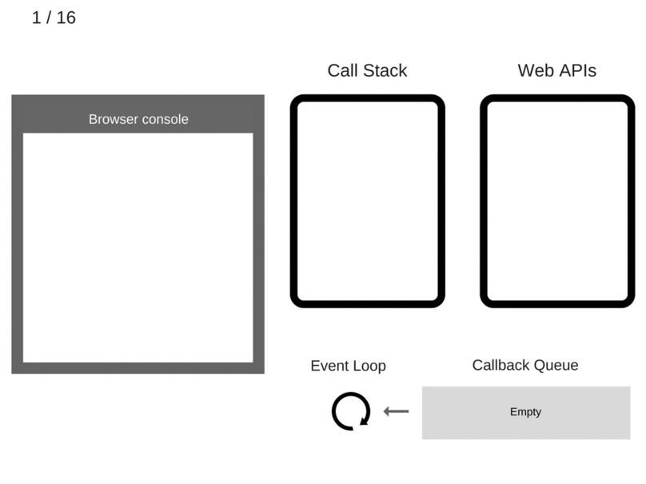

# Event loop

> The common denominator in all environments is a built-in mechanism called the event loop, which _handles the execution of multiple chunks of your program over time_, each time invoking the JS Engine.  

6. setTimeout(function cb1() { ... }) is executed. The browser creates a timer as part of the Web APIs. It is going to handle the countdown for you.  
7. The setTimeout(function cb1() { ... }) itself is complete and is removed from the Call Stack.  
11. After at least 5000 ms, the timer completes and it pushes the cb1 callback to the Callback Queue.  
12. The Event Loop takes cb1 from the Callback Queue and pushes it to the Call Stack.  
13. cb1 is executed and adds console.log('cb1') to the Call Stack.

So, for example, when your JavaScript program makes an Ajax request to fetch some data from the server, you set up the “response” code in a function (the “callback”), and the JS Engine tells the hosting environment:
“Hey, I’m going to suspend execution for now, but whenever you finish with that network request, and you have some data, please call this function back.”

The browser is then set up to listen for the response from the network, and when it has something to return to you, it will schedule the callback function to be executed by inserting it into the event loop.

---

That doesn’t mean that myCallback will be executed in 1,000 ms but rather that, in 1,000 ms, myCallback will be added to the **event loop queue**. The queue, however, might have other events that have been added earlier — your callback **will have to wait**.

There are quite a few articles and tutorials on getting started with async code in JavaScript that suggest doing a setTimeout(callback, 0). Well, now you know what the Event Loop does and how setTimeout works: calling setTimeout with 0 as a second argument just defers the callback **until the Call Stack is clear.**